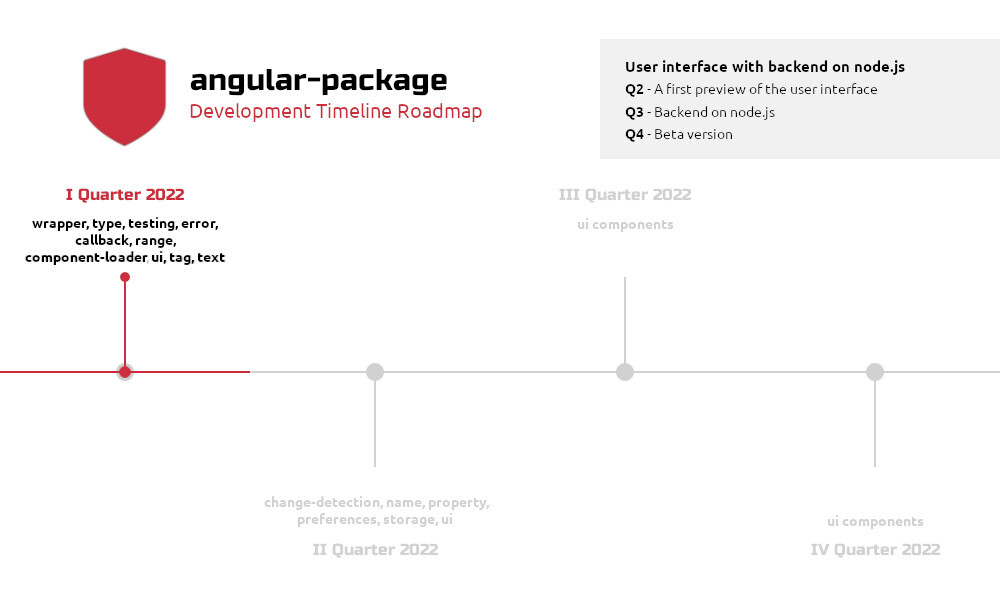

# Introduction

## angular-package/error

The error package contains a typical, range, type, and validation error object extended by the javascript error. Their message is built from the required problem, solution to a problem, and unique identification number on the error message template. Individual errors have additional message parameters corresponding to the functionality. Range error has an additional minimum and maximum range that causes an error to be thrown or not thrown, and type error the type.

The package contains prepared objects to manage the errors of the same type and multiple identification numbers, and their purpose is to set and throw errors under the given identification.

